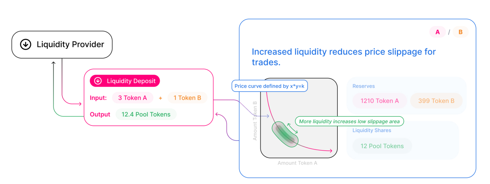

Materia is an *automated liquidity protocol* powered by a <Link to="/docs/materia/protocol-overview/glossary/#constant-product-formula">constant product formula</Link>
which core is a system of non-upgradeable smart contracts on the [Ethereum](https://ethereum.org/) blockchain based on [Uniswap V2](https://uniswap.org/).
It obviates the need for trusted intermediaries, prioritizing **decentralization**, **censorship resistance**, 
and **security**. Materia is **open-source software** licensed under the
[GPL](https://en.wikipedia.org/wiki/GNU_General_Public_License).

It differs from Uniswap mainly for two reasons:

- Every pair is made up by a generic [ERC-20](https://eips.ethereum.org/EIPS/eip-20) [ITEM](https://ethitem.com/) interoperable and the [Wrapped USD](https://www.unifihub.com/), an innovative stablecoin tied to the the American Dollar.
- Materia, as well as being a protocol, is also a [DFO](https://www.dfohub.com/), a Decentralized Flexible Organizations. This allows the GIL holders (the Materia DFO's governance token) to customize the protocol's parameters in real decentralized way, simply interacting with a set of smart contracts, possibile future applications are endless.

Each Materia pair manages a liquidity pool made up of reserves of the generic token and the WUSD token.

Anyone can become a liquidity provider (LP) for a pool by depositing an equivalent value of WUSD and the token in return for pool tokens. These tokens track pro-rata LP shares of the total reserves, and can be redeemed for the underlying assets at any time.

Pairs act as automated market makers, standing ready to accept one token for the other as long as the “constant product” formula is preserved. This formula, most simply expressed as `x * y = k`, states that trades must not change the product (`k`) of a pair’s reserve balances (`x` and `y`). Because `k` remains unchanged from the reference frame of a trade, it is often referred to as the invariant. This formula has the desirable property that larger trades (relative to reserves) execute at exponentially worse rates than smaller ones, this loss is called *slippage*.

In practice, Materia applies a fee to trades, which is added to reserves, this swap is called *swap fee*. As a result, each trade actually increases `k`. This functions as a payout to LPs and to the Materia DFO itsef, which is realized when they burn their pool tokens to withdraw their portion of total reserves.
The fee reserved for the Materia DFO is called *Materia fee* and it's expressed as a percentual of the *swap fee*.
The default values (possibly editable by a proposal) are 0.30% for the *swap fee* and 16% for the *Materia fee*, this means that the traders will pay a fee of 0.3% but the liquidity providers will receive about 0.25%, i.e. 0.30% taken out the *Materia fee*.

Because the relative price of the two pair assets can only be changed through trading, divergences between the Materia price and external prices create arbitrage opportunities. This mechanism ensures that Materia prices always trend toward the market-clearing price.

# Further reading

To see how token swaps work in practice, and to walk through the lifecycle of a swap, check out <Link to="/docs/materia/core-concepts/swaps">Swaps</Link>. Or, to see how liquidity pools work, see <Link to="/docs/materia/core-concepts/pools">Pools</Link>.

Ultimately, of course, the Materia protocol is just smart contract code running on Ethereum. To understand how they work, head over to <Link to="/docs/materia/protocol-overview/smart-contracts/">Smart Contracts</Link>.
